# 🎨 COMPETITIVE INTELLIGENCE DASHBOARD

## 📋 CUPRINS

1. [Overview](#overview)
2. [Componente Dashboard](#componente-dashboard)
3. [Funcționalități](#functionalitati)
4. [API Integration](#api-integration)
5. [Usage Guide](#usage-guide)
6. [Customization](#customization)

---

## 🎯 OVERVIEW

Dashboard profesional, modern și intuitiv pentru sistemul de Competitive Intelligence.

### ✨ FEATURES

- ✅ **Design Modern & Responsive**
  - UI/UX premium
  - Animații fluide
  - Gradient backgrounds
  - Mobile-friendly

- ✅ **Real-time Data**
  - Live stats
  - Auto-refresh
  - API integration
  - Loading states

- ✅ **Comprehensive Analytics**
  - KPI cards
  - Top competitors
  - Chart visualizations
  - SWOT analysis
  - Action items

- ✅ **Advanced Filtering**
  - Search by domain
  - Filter by score
  - Filter by type
  - Pagination
  - Export functionality

---

## 📊 COMPONENTE DASHBOARD

### 1. MAIN DASHBOARD (`competitive_dashboard.html`)

**URL:** `http://localhost:5000/static/competitive_dashboard.html`

**Componente:**

#### A. Header Section
```html
- Logo & Title
- Subtitle cu descriere
- Butoane acțiuni:
  - Refresh data
  - Export report
```

#### B. Stats Cards (4 KPI-uri)
```javascript
1. Total Agenți
   - Master + Slave agents
   - Trend indicator

2. Competitori Identificați
   - Total discovered
   - Coverage percentage

3. Keywords Monitorizate
   - Total keywords
   - Subdomains count

4. Relații Master-Slave
   - Active relationships
   - Link indicator
```

#### C. Top 10 Competitori
```javascript
Pentru fiecare competitor:
- Rank badge (1-10)
- Domain name
- Appearances count
- Average position
- Score (color-coded)
- Agent badge (dacă e slave)
```

#### D. Subdomain Chart
```javascript
- Chart.js bar chart
- 6 subdomenii
- Competitor count per subdomain
- Interactive tooltips
```

#### E. DeepSeek Analysis
```javascript
SWOT Analysis:
- Top 3 Strengths (green)
- Top 3 Weaknesses (red)
- Top 3 Opportunities (blue)
```

#### F. Action Items
```javascript
5 acțiuni prioritizate:
- Checkbox pentru tracking
- Priority badge (Urgent/Important/Normal)
- Action description
```

---

### 2. FULL VIEW DASHBOARD (`competitive_dashboard_full.html`)

**URL:** `http://localhost:5000/static/competitive_dashboard_full.html`

**Funcționalități:**

#### A. Advanced Search & Filters
```javascript
- Search box (by domain)
- Filter by score:
  - All
  - High (>60)
  - Medium (45-60)
  - Low (<45)
- Filter by type:
  - Only agents
- Export to CSV
```

#### B. Stats Bar
```javascript
Real-time statistics:
- Total shown
- Average score
- Total keywords
- Agent count
```

#### C. Complete Competitors Table
```javascript
Columns:
1. Rank (#)
2. Domain
3. Score (badge color-coded)
4. Keywords count
5. Average position
6. Subdomains (tags)
7. Status (Agent badge)
8. Actions (view details)

Pagination: 50 items per page
```

---

## 🔧 FUNCȚIONALITĂȚI

### 1. Data Loading

```javascript
// Main dashboard
async function initDashboard() {
    await Promise.all([
        loadStats(),
        loadCompetitors(),
        loadAnalysis(),
        loadActionItems()
    ]);
}
```

### 2. API Endpoints Used

```javascript
// Stats
GET /agents/{id}/competitive-landscape

// Competitors
GET /agents/{id}/competitors

// Analysis
GET /agents/{id}/competition-analysis

// Slave agents
GET /agents/{id}/slave-agents
```

### 3. Filtering & Search

```javascript
// Search by domain
function filterCompetitors() {
    const searchTerm = $('#searchInput').val().toLowerCase();
    filteredCompetitors = allCompetitors.filter(comp => 
        comp.domain.toLowerCase().includes(searchTerm)
    );
}

// Filter by score
function filterByScore(type) {
    switch(type) {
        case 'high': 
            return competitors.filter(c => c.score > 60);
        case 'medium': 
            return competitors.filter(c => c.score >= 45 && c.score <= 60);
        case 'low': 
            return competitors.filter(c => c.score < 45);
    }
}
```

### 4. Export Functionality

```javascript
function exportToCSV() {
    const csvContent = [
        ['Rank', 'Domain', 'Score', 'Keywords', 'Avg Position', 'Is Agent'],
        ...filteredCompetitors.map((c, i) => [
            i + 1,
            c.domain,
            c.score.toFixed(1),
            c.appearances_count,
            c.avg_position?.toFixed(1) || '-',
            c.isAgent ? 'Yes' : 'No'
        ])
    ].map(row => row.join(',')).join('\n');
    
    // Download file
    const blob = new Blob([csvContent], { type: 'text/csv' });
    const url = window.URL.createObjectURL(blob);
    const a = document.createElement('a');
    a.href = url;
    a.download = `competitors_${Date.now()}.csv`;
    a.click();
}
```

---

## 🌐 API INTEGRATION

### Current Endpoints

```javascript
const MASTER_AGENT_ID = '6910ef1d112d6bca72be0622';
const API_BASE = 'http://localhost:5000';

// 1. Competitive Landscape
GET ${API_BASE}/agents/${MASTER_AGENT_ID}/competitive-landscape
Response: {
    ok: true,
    master: {...},
    slaves: [...],
    relationships: [...],
    analytics: {...}
}

// 2. All Competitors
GET ${API_BASE}/agents/${MASTER_AGENT_ID}/competitors
Response: {
    ok: true,
    competitors: [
        {
            domain: "competitor.ro",
            score: 65.5,
            appearances_count: 8,
            avg_position: 3.2,
            subdomains: [...]
        }
    ]
}

// 3. DeepSeek Analysis
GET ${API_BASE}/agents/${MASTER_AGENT_ID}/competition-analysis
Response: {
    ok: true,
    analysis: {
        analysis_data: {
            strengths: [...],
            weaknesses: [...],
            opportunities: [...],
            threats: [...],
            immediate_actions: [...]
        }
    }
}

// 4. Slave Agents
GET ${API_BASE}/agents/${MASTER_AGENT_ID}/slave-agents
Response: {
    ok: true,
    slaves: [
        {
            id: "...",
            domain: "slave.ro",
            created_at: "...",
            validation_passed: true
        }
    ]
}
```

### New Extended Endpoints (Optional)

Adaugă în `agent_api.py` din `dashboard_api_endpoints.py`:

```python
# Analytics detaliate
GET /api/dashboard/analytics/{agent_id}

# Detalii competitor specific
GET /api/dashboard/competitor-details/{agent_id}/{domain}

# Export în format specific
GET /api/dashboard/export/{agent_id}/{format}  # format: csv/json

# Comparație între agenți
GET /api/dashboard/compare/{agent1_id}/{agent2_id}
```

---

## 📖 USAGE GUIDE

### Quick Start

1. **Deschide Dashboard-ul Principal**
   ```bash
   # Browser
   http://localhost:5000/static/competitive_dashboard.html
   ```

2. **Explorează Date**
   - Vezi stats cards pentru overview
   - Scroll la Top 10 competitori
   - Analizează chart-ul subdomenii
   - Citește analiza DeepSeek
   - Verifică action items

3. **Vezi Toți Competitorii**
   - Click "Vezi toți" din Top 10
   - SAU navighează direct:
   ```bash
   http://localhost:5000/static/competitive_dashboard_full.html
   ```

4. **Filtrare și Search**
   ```javascript
   // Search
   Type in search box: "ignis"
   
   // Filter by score
   Click: "Score Mare (>60)"
   
   // Filter agents only
   Click: "Doar Agenți"
   ```

5. **Export Date**
   ```javascript
   // CSV Export
   Click: "Export CSV" button
   
   // Will download: competitors_YYYY-MM-DD.csv
   ```

### Workflow Complet

```mermaid
graph LR
    A[Deschide Dashboard] --> B[Vezi Stats]
    B --> C[Analizează Top 10]
    C --> D{Vrei detalii?}
    D -->|Da| E[Vezi Full View]
    D -->|Nu| F[Citește SWOT]
    E --> G[Filtrează/Search]
    G --> H[Export CSV]
    F --> I[Verifică Actions]
    I --> J[Implementează]
```



---

## 🎨 CUSTOMIZATION

### 1. Schimbă Culorile

```css
:root {
    --primary: #2563eb;        /* Albastru principal */
    --secondary: #10b981;      /* Verde secondary */
    --danger: #ef4444;         /* Roșu */
    --warning: #f59e0b;        /* Portocaliu */
    --dark: #1e293b;           /* Text dark */
    --light: #f8fafc;          /* Background light */
}
```

### 2. Modifică Agent ID

```javascript
// În competitive_dashboard.html și competitive_dashboard_full.html
const MASTER_AGENT_ID = '6910ef1d112d6bca72be0622';  // Schimbă aici
```

### 3. Ajustează Pagination

```javascript
// În competitive_dashboard_full.html
const itemsPerPage = 50;  // Schimbă numărul de items per page
```

### 4. Personalizează Charts

```javascript
// În competitive_dashboard.html - loadSubdomainChart()
new Chart(ctx, {
    type: 'bar',  // Schimbă în: 'line', 'pie', 'doughnut'
    data: {...},
    options: {
        // Modifică opțiunile aici
        backgroundColor: [...],  // Culori custom
        borderRadius: 8          // Forma barelor
    }
});
```

### 5. Adaugă Noi Stats Cards

```html
<div class="stat-card">
    <div class="stat-header">
        <div class="stat-icon primary">
            <i class="fas fa-rocket"></i>  <!-- Icon nou -->
        </div>
    </div>
    <div class="stat-value" id="myNewStat">-</div>
    <div class="stat-label">Metric Nou</div>
</div>
```

```javascript
// Load data
document.getElementById('myNewStat').textContent = myValue;
```

---

## 🔥 FEATURES AVANSATE

### 1. Auto-Refresh

```javascript
// Adaugă în script
setInterval(() => {
    initDashboard();
}, 60000);  // Refresh la 60 secunde
```

### 2. Dark Mode

```css
/* Adaugă în CSS */
@media (prefers-color-scheme: dark) {
    :root {
        --light: #1e293b;
        --dark: #f8fafc;
        --border: #334155;
    }
    
    body {
        background: #0f172a;
    }
}
```

### 3. Notifications

```javascript
// Adaugă library: Toastify
<script src="https://cdn.jsdelivr.net/npm/toastify-js"></script>

// Usage
Toastify({
    text: "Date actualizate cu succes!",
    duration: 3000,
    backgroundColor: "linear-gradient(to right, #00b09b, #96c93d)"
}).showToast();
```

### 4. Real-time Updates (WebSocket)

```javascript
// Connect to WebSocket
const ws = new WebSocket('ws://localhost:5000/ws');

ws.onmessage = (event) => {
    const data = JSON.parse(event.data);
    if (data.type === 'competitor_update') {
        initDashboard();  // Refresh
    }
};
```

---

## 📱 RESPONSIVE DESIGN

### Breakpoints

```css
/* Desktop: >1200px */
.content-grid {
    grid-template-columns: 2fr 1fr;
}

/* Tablet: 768px - 1200px */
@media (max-width: 1200px) {
    .content-grid {
        grid-template-columns: 1fr;
    }
}

/* Mobile: <768px */
@media (max-width: 768px) {
    .stats-grid {
        grid-template-columns: 1fr;
    }
    
    .dashboard-header {
        flex-direction: column;
    }
}
```

---

## 🐛 TROUBLESHOOTING

### Dashboard nu încarcă date

1. **Verifică API-ul**
   ```bash
   curl http://localhost:5000/agents/6910ef1d112d6bca72be0622/competitors
   ```

2. **Verifică Console Browser**
   - F12 → Console
   - Verifică erori JavaScript

3. **Verifică CORS**
   ```python
   # În agent_api.py
   from flask_cors import CORS
   CORS(app)
   ```

### Stiluri nu se aplică

1. **Clear Cache**
   - Ctrl + F5 (hard refresh)

2. **Verifică CDN-uri**
   - Font Awesome
   - Chart.js
   - Axios

### Export CSV nu funcționează

1. **Browser Security**
   - Permite downloads în browser
   - Verifică pop-up blocker

---

## 🚀 NEXT STEPS

### Implementări Viitoare

1. **Dashboard Analytics Extended**
   - Time series charts
   - Trend analysis
   - Predictive insights

2. **Competitor Profiles**
   - Detailed view per competitor
   - Historical data
   - Change tracking

3. **Alerts & Notifications**
   - New competitors
   - Ranking changes
   - Score updates

4. **Multi-Agent Dashboard**
   - View all master agents
   - Compare multiple agents
   - Portfolio overview

---

## 📞 SUPPORT

Pentru întrebări sau probleme:
- Check `ACTION_PLAN.md` pentru roadmap
- Review API endpoints în `agent_api.py`
- Test cu `test_competitive_analysis.py`

---

**🎯 DASHBOARD 100% FUNCȚIONAL ȘI GATA DE PRODUCȚIE!**

